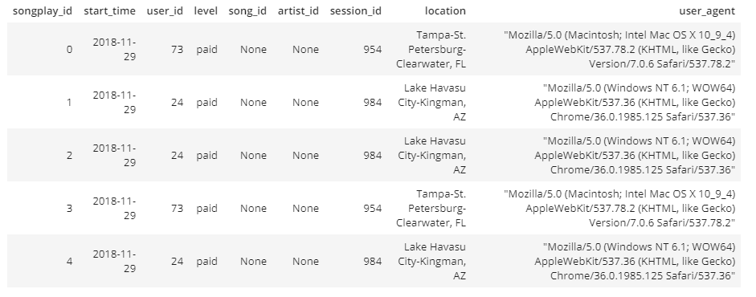

# Project: Data Modeling with Postgres

A startup called Sparkify wants to analyze the data they've been collecting on songs and user activity on their new music streaming app. The analytics team is particularly interested in understanding what songs users are listening to. Currently, they don't have an easy way to query their data, which resides in a directory of JSON logs on user activity on the app, as well as a directory with JSON metadata on the songs in their app.

### Song Dataset

The first dataset is a subset of real data from the [Million Song Dataset](https://labrosa.ee.columbia.edu/millionsong/). Each file is in JSON format and contains metadata about a song and the artist of that song. The files are partitioned by the first three letters of each song's track ID. For example, here are filepaths to two files in this dataset.

```
data/song_data/A/B/C/TRABCEI128F424C983.json
data/song_data/A/A/B/TRAABJL12903CDCF1A.json
```

And below is an example of what a single song file, TRAABJL12903CDCF1A.json, looks like.

```
{"num_songs": 1, "artist_id": "ARJIE2Y1187B994AB7", "artist_latitude": null, "artist_longitude": null, "artist_location": "", "artist_name": "Line Renaud", "song_id": "SOUPIRU12A6D4FA1E1", "title": "Der Kleine Dompfaff", "duration": 152.92036, "year": 0}
```

### Log Dataset

The second dataset consists of log files in JSON format generated by [this event simulator](https://github.com/Interana/eventsim) based on the songs in the dataset above. These simulate activity logs from a music streaming app based on specified configurations.  
The log files in the dataset you'll be working with are partitioned by year and month. For example, here are filepaths to two files in this dataset.

```
log_data/2018/11/2018-11-12-events.json
log_data/2018/11/2018-11-13-events.json
```
And below is an example of what the data in a log file, looks like.

```{"artist":"The Kooks","auth":"Logged In","firstName":"Sara","gender":"F","itemInSession":0,"lastName":"Johnson","length":132.25751,"level":"paid","location":"Winston-Salem, NC","method":"PUT","page":"NextSong","registration":1540809153796.0,"sessionId":152,"song":"Eddie's Gun","status":200,"ts":1541260356796,"userAgent":"\"Mozilla\/5.0 (iPhone; CPU iPhone OS 7_1_2 like Mac OS X) AppleWebKit\/537.51.2 (KHTML, like Gecko) Version\/7.0 Mobile\/11D257 Safari\/9537.53\"","userId":"95"}
```

## Project structure

Files used on the project:

1. `data` is the folder where all needed jsons reside.
1. `create_tables.py` drops and creates your tables. You run this file to reset your tables before each time you run your ETL scripts.
1. `sql_queries.py` contains all your sql queries, and is imported into the files below.
1. `test.ipynb` displays the first few rows of each table to let you check your database.
1. `etl.ipynb` reads and processes a single file from song_data and log_data and loads the data into your 1. tables.
1. `etl.py` reads and processes files from song_data and log_data and loads them into your tables.
1. `README.md` is an overview of the whole project.

## Schema for Song Play Analysis

Using the song and log datasets, I created a star schema database optimized for queries on song play analysis, which is composed of the following tables.

#### Fact Table

***songplays*** - records in log data associated with song plays:
- songplay_id int PRIMARY KEY;
- start_time date REFERENCES time(start_time);
- user_id int NOT NULL REFERENCES users(user_id);
- level ENUM ('paid', 'free');
- song_id text REFERENCES songs(song_id);
- artist_id text REFERENCES artists(artist_id);
- session_id int;
- location text;
- user_agent text.

#### Dimension Tables

***users*** - users in the app:
- user_id int PRIMARY KEY;
- first_name text;
- last_name text;
- gender ENUM ('M', 'F');
- level ENUM ('paid', 'free').

***songs*** - songs in music database:
- song_id text PRIMARY KEY;
- title text;
- artist_id text NOT NULL REFERENCES artists(artist_id);
- year int;
- duration float NOT NULL.

***artists*** - artists in music database:
- artist_id text PRIMARY KEY;
- name text;
- location text;
- latitude float;
- longitude float.

***time*** - timestamps of records in songplays broken down into specific units:
- start_time date PRIMARY KEY;
- hour int;
- day int;
- week int;
- month int;
- year int;
- weekday text.

## ETL Pipeline

The pipeline works by identifying every json file in the target directory and extracting the necessary informations from each of them to insert in the appropriate table.  
To execute the pipeline you just need to create the database by using the terminal running the command:
```
python create_tables.py
```
And then trigger the pipeline execution, still on the terminal, with:
```
python etl.py
```
You will be shown the progress of the pipeline in the command line and you can also use the `test.ipynb` notebook to verify that each step was executed successfully.  

Here five rows of the songplays table as a preview of the final output:


